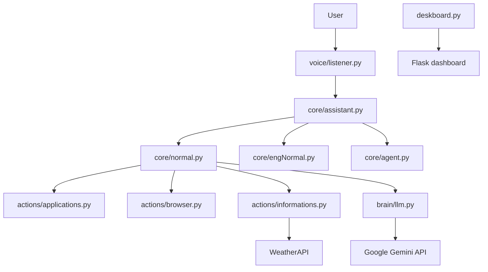

# Nexa

Nexa is a Python-based desktop assistant prototype that listens for voice commands, switches between operating modes, and can open applications, answer general questions, tell the time, and check the weather. The project is built around a simple local command loop and integrates with Google Gemini for AI responses.

This repository appears to be an experimental project rather than a production-ready application. It combines voice input/output, desktop automation, and a lightweight Flask dashboard prototype.

## Project Status

Prototype / experimental.

The codebase contains working command handlers for several local actions, but several parts are partial, intentionally placeholder-like, or not fully integrated into the main runtime flow.

## Features

### Implemented Features

- Voice command input using `speech_recognition`
  - `voice/listener.py` listens for microphone input and sends the result to the assistant.
  - Uses Google Speech Recognition for transcription.

- Voice output using `gTTS` and `pygame`
  - `voice/speaker.py` converts text to speech and plays the generated MP3.

- Mode switching system
  - `core/assistant.py` supports three modes:
    - Normal Mode (`current_mode = 1`)
    - English Learning Mode (`current_mode = 2`)
    - Agentic Mode (`current_mode = 3`)
  - Commands like `change mode` trigger the mode selector.

- Normal assistant behavior
  - `core/normal.py` exposes methods such as:
    - `open_chrome()`
    - `open_youtube()`
    - `open_vs_code()`
    - `today_weather()`
    - `time_now()`
    - `open_github()`
    - `open_lead_code()`
    - `open_insta()`
    - `open_facebook()`
  - For unrecognized commands, the assistant falls back to `brain.llm.apiprocess()`.

- AI response integration via Google Gemini
  - `brain/llm.py` loads `GEMINI_API_KEY` from `.env` and calls the Google GenAI SDK.
  - It writes a log of successes, retries, and failures to `data/logs.txt`.

- Browser automation
  - `actions/browser.py` opens common sites in the default browser.

- Application launching via desktop automation
  - `actions/applications.py` uses `pyautogui` to open Chrome, VS Code, and YouTube through Windows search.

- Weather lookup integration
  - `actions/informations.py` prompts for a city and queries WeatherAPI using `WEATHER_API_KEY`.

- Simple dashboard prototype
  - `deskboard.py` creates a Flask UI with a neon command-center style interface.
  - It reads log data from `brain/logs.txt` and renders it in HTML.

### Partially Implemented Features

- Agentic mode placeholder
  - `core/agent.py` contains `NexaAgentic.default()` but only prints a message saying the feature is still in development.
  - This is explicitly unfinished and not operational.

- English learning mode
  - `core/engNormal.py` exists, but its learning logic is not implemented beyond basic mode scaffolding.

- NLP utilities
  - `utils/getverb.py` loads `en_core_web_sm` from spaCy and attempts to extract a verb and target phrase from text.
  - It is not connected to the runtime assistant flow.
  - `utils/translator.py` and `utils/grammerC.py` are scripts and utilities, not integrated into the main assistant workflow.

- Dashboard/logging consistency
  - The dashboard reads from `brain/logs.txt`, but the AI module writes to `data/logs.txt`.
  - The repository therefore contains a mismatch between the file paths used by different modules.

### Planned / Future Features

The following are future-oriented, based on repository evidence:

- Full Agentic Mode implementation
  - Evidence: `core/agent.py` prints "Agentic Mode is in working process" and a GitHub update message.
  - Status: not implemented.

- Improved English learning workflow
  - Evidence: `EnglearnMode` exists as a subclass but has no meaningful teaching logic.

- Better command parsing and intent recognition
  - Evidence: `utils/getverb.py` contains a verb extraction utility that is not wired into the main assistant.

- More complete desktop automation
  - Evidence: app openers exist, but there are no broader automation workflows or safe command validation layers.

- Stabilized dashboard and logging pipeline
  - Evidence: `deskboard.py` and `brain/llm.py` write/read different log file locations.

## Architecture

Nexa follows a simple modular desktop-assistant structure:



At runtime, the application:

1. Uses a microphone listener to collect user speech.
2. Passes the recognized text to `NexaAssistant.run()`.
3. Checks whether the user says `change mode`.
4. Routes the command to the active mode handler.
5. If no method matches, the command falls back to the generic AI response path.

## Project Structure

```text
Nexa/
├── actions/
│   ├── applications.py
│   ├── browser.py
│   └── informations.py
├── brain/
│   └── llm.py
├── core/
│   ├── agent.py
│   ├── assistant.py
│   ├── engNormal.py
│   └── normal.py
├── utils/
│   ├── getverb.py
│   ├── grammerC.py
│   └── translator.py
├── voice/
│   ├── listener.py
│   └── speaker.py
├── .gitignore
├── deskboard.py
├── main.py
├── requirements.txt
└── README.md
```

### Module responsibilities

- `main.py` starts the assistant.
- `core/assistant.py` manages the assistant lifecycle and mode switching.
- `core/normal.py` implements default assistant actions.
- `core/agent.py` is a placeholder for future agentic behavior.
- `core/engNormal.py` defines the scaffolding for an English-learning mode.
- `brain/llm.py` sends text commands to Google Gemini.
- `actions/*` contains desktop and browser actions.
- `voice/*` handles microphone capture and text-to-speech.
- `utils/*` contains experimental NLP and translation helpers.
- `deskboard.py` is a standalone Flask dashboard.

## Installation

### Prerequisites

- Python 3.8+ is likely required, but the repository does not specify an exact Python version.
- A microphone and speakers are required for interactive use.
- A desktop environment is expected because the project calls `pyautogui` and opens local applications.

### Clone the repository

```bash
git clone https://github.com/Hxrdik-24/Nexa.git
cd Nexa
```

### Create a virtual environment

```bash
python -m venv .venv
source .venv/bin/activate
# On Windows:
# .venv\Scripts\activate
```

### Install dependencies

```bash
pip install -r requirements.txt
```

### Optional language model setup for spaCy

`utils/getverb.py` loads `en_core_web_sm`, which is not added by `requirements.txt`.

If you want to run that utility directly, install the model:

```bash
python -m spacy download en_core_web_sm
```

### Required external services

- Google Gemini API key for `brain/llm.py`
- WeatherAPI key for `actions/informations.py`

## Configuration

The repository uses environment variables via `python-dotenv`.

Create a `.env` file in the project root (it is ignored by `.gitignore`):

```env
GEMINI_API_KEY=your_gemini_api_key_here
WEATHER_API_KEY=your_weatherapi_key_here
```

### Environment variables

| Variable | Purpose | Required | Where used |
| --- | --- | --- | --- |
| `GEMINI_API_KEY` | Authenticates requests to the Google Gemini API | Yes for AI responses | `brain/llm.py` |
| `WEATHER_API_KEY` | Authenticates requests to WeatherAPI | Yes for weather lookups | `actions/informations.py` |

Do not commit real credentials. The repository ignores `.env` by default.

## Usage

### Start the assistant

```bash
python main.py
```

Then speak commands such as:

- `change mode`
- `open chrome`
- `open youtube`
- `open vs code`
- `time now`
- `today weather`
- `open github`
- `exit`

### Generic AI fallback

If no direct method matches the command, `NormalMode.default()` calls `apiprocess(command)`, which sends the message to Gemini and returns a short answer.

### Run the dashboard prototype

```bash
python deskboard.py
```

Then open the Flask app in a browser. The file uses a local web interface and reads logs from `brain/logs.txt`; note that the actual AI logging path is `data/logs.txt` in `brain/llm.py`.

## Tech Stack

### Language

- Python

### Audio / Speech

- `speechrecognition`
- `gtts`
- `pygame`

### AI / ML

- Google Gemini via `google.genai`
- `spacy` (used by the utility scripts)
- `deep_translator`

### Automation

- `pyautogui`
- `webbrowser`

### Web / UI

- Flask
- Tailwind CSS via CDN in `deskboard.py`

### Data / APIs

- WeatherAPI via `requests`
- Google Speech Recognition

### Environment / config

- `python-dotenv`

## Security

The repository includes minimal security-related patterns, but it is not a hardened security system.

### Implemented

- `.env` is listed in `.gitignore` to reduce the chance of committing secrets.
- `brain/llm.py` reads API keys from environment variables instead of hardcoding them.
- `actions/informations.py` uses environment-based WeatherAPI authentication.

### Notably absent or weak

- No authentication or authorization layer for the assistant.
- No explicit request validation or sanitization beyond command-length checks in `brain/llm.py`.
- No rate limiting, CORS settings, or security headers, because there is no production web API surface.
- `pyautogui` automation can trigger arbitrary local actions if commands are untrusted or malicious.
- The speech pipeline sends audio to Google Speech Recognition, which is an external service dependency.

### Security Improvements / Future Work

- Add explicit validation before executing desktop automation commands.
- Restrict or sandbox app launches when running in a shared environment.
- Normalize log file paths and avoid divergent storage locations.
- Add proper configuration validation for missing environment variables.
- Add user-level confirmation before destructive or sensitive actions.

## API Documentation

No HTTP API is implemented in this repository.

This project is primarily a local Python assistant and does not expose REST endpoints or a formal API contract.

## Examples

### Example: open browser

```python
from actions.browser import openGithub
openGithub()
```

### Example: weather lookup

```python
from actions.informations import weathernow
weathernow()
```

### Example: Gemini response

```python
from brain.llm import apiprocess
print(apiprocess("what is the capital of France?"))
```

## Testing

No automated test suite is present in the repository.

The repo does not contain:

- `pytest.ini`
- `tests/` directory
- `unittest` test files
- CI workflow configuration in the checked tree

Manual testing is currently the primary validation method. The code is designed to be run interactively through voice commands and local desktop actions.

## Roadmap

Based on evidence in the repository, the likely future work is:

1. Complete the Agentic Mode
   - Evidence: `core/agent.py` explicitly says the feature is still in progress.

2. Finish the English learning mode
   - Evidence: `core/engNormal.py` exists but contains only scaffolding.

3. Integrate NLP utilities into the running assistant
   - Evidence: `utils/getverb.py` is present but not connected to `NexaAssistant`.

4. Repair dashboard/logging consistency
   - Evidence: `deskboard.py` reads from `brain/logs.txt` while `brain/llm.py` writes to `data/logs.txt`.

5. Add real validation and safety controls around automation
   - Evidence: the project launches applications and browser tabs without a strong safety layer.

## Contributing

There are no formal contribution rules defined in the repository, but a reasonable workflow is:

1. Fork or clone the repository.
2. Create a feature branch:

```bash
git checkout -b feature/your-change
```

3. Install dependencies and validate locally:

```bash
pip install -r requirements.txt
python -m compileall .
```

4. Make focused changes that match the project’s existing structure.
5. Validate the relevant behavior manually, since there is no automated test suite.
6. Open a pull request with a clear description of the change and any setup requirements.

## License

No license file is currently present.

## Author / Project Information

The repository is hosted under the GitHub owner `Hxrdik-24`.

No additional author bio, company information, production status, or formal project metadata is documented in the repository itself.

## README Quality Notes

This README reflects the repository as it exists in code rather than aspirational descriptions. It intentionally avoids claiming production readiness or enterprise capabilities that are not supported by the implementation.

## Final Self-Audit

- Major implemented features are documented.
- Unfinished features are clearly marked as partial or planned.
- Installation commands correspond to the repo’s dependencies and setup pattern.
- Environment variables are documented without exposing secrets.
- Project structure reflects the actual repository layout.
- Security claims are limited to what is actually implemented.
- Testing information is accurate: no automated tests are present.
- License information is accurate: no license file exists.

